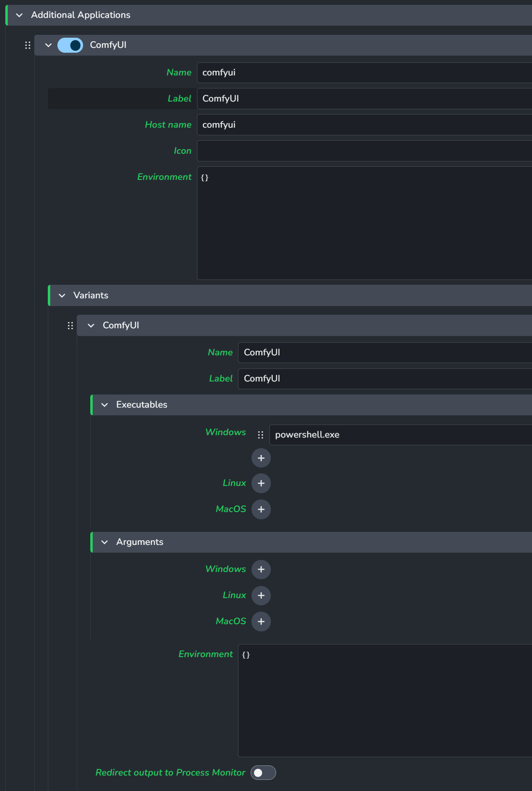
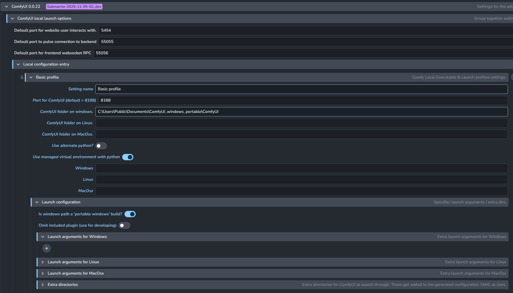
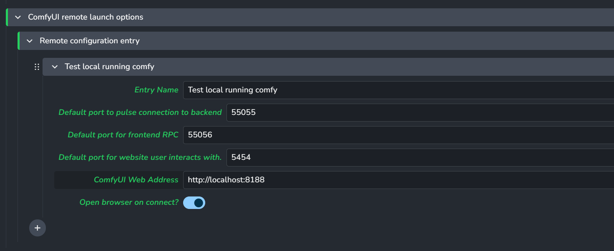
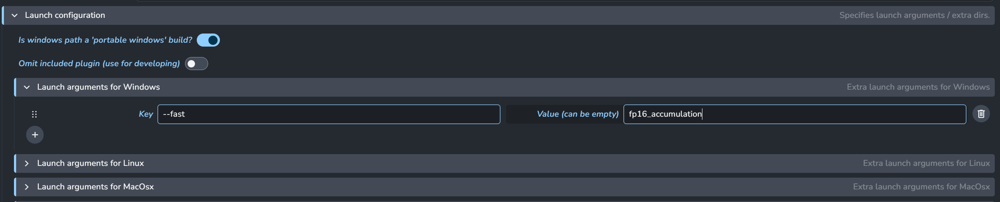
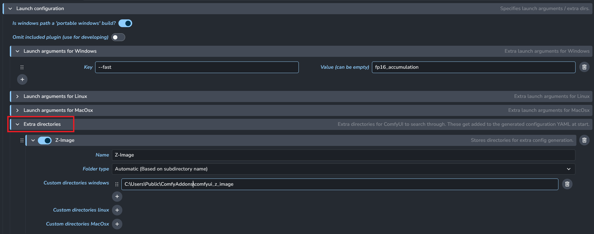
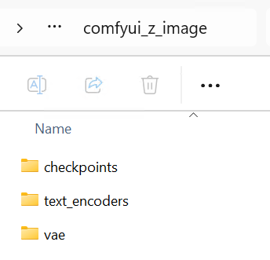
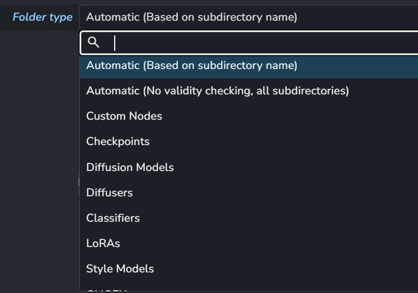
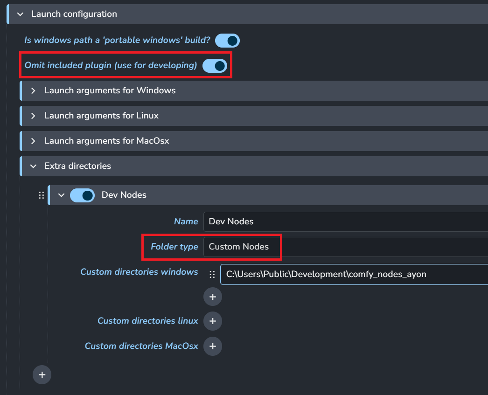
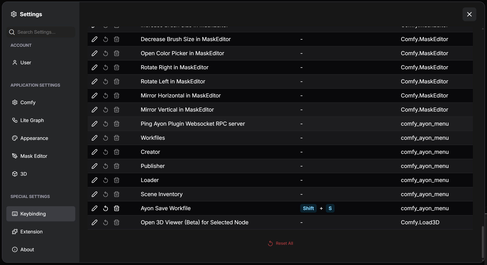

Ayon ComfyUI Setup Guide
---

Setting up ComfyUI for Ayon can be a bit of a hassle,<br>
but with this guide, hopefully, step by step you'll get it going!

Assuming ayon_comfyui is already in an active bundle:

### 1. Getting ComfyUI

Download a [release of ComfyUI from ComfyOrg on GitHub](https://github.com/Comfy-Org/ComfyUI/releases).

> [!Note]
> The plugin has been tested with ComfyUI Windows Standalone 0.18.1


### 2. Setup AYON Applications

Add an entry for ComfyUI as an application in the webui settings for `Applications / Additional Applications`

<details>
<summary>Setup for Ayon Applications settings</summary>
In the AYON web interface, navigate to either Studio or Project settings, and choose the Applications plugin.<br>
We need to add an entry for ComfyUI.

Please note that the `Name` and `Host name` entries need to be lowercase: `comfyui`.



</details>

### 3. Setting up basic profiles

The plugin for ComfyUI works on profiles, divided into local and remote profiles.


Note that all string entries in the menu that pertain to paths (including custom directory settings and launch arguments), can receive **template formatting**, e.g.<br>
`{roots[work]}/{project[name]}/Lab/comfyui/0.18.2/ComfyUI`

(change root name to preferred root as set up in studio anatomy settings.)

This mimics the way roots work in `applications`.

<details>
<summary>Setting up a basic local launch profile:</summary>

Local launch profiles focus on launching ComfyUI locally, and then connecting to that locally launched instance.<br>
The only thing you need to change to get a local profile going, is to
1. Add a name
2. Point to the ComfyUI path in the ComfyUI folder (not the root windows portable folder, if using.)

Like this example:



Do not worry about the rest of the options for now.

Note that for a portable windows build, no `--windows-standalone-build` is needed.<br>
The plugin will automatically add it based on the `Is windows path a 'portable windows build'` toggle and OS.

</details>
<details>
<summary>Setting up a basic remote launch profile:</summary>

Remote launch profiles' only function is to connect to a ComfyUI server that is already running,<br>
and that has the included plugin in the custom nodes folder so that it can use AYON functionality.

To set one up;
1. Add a name
2. Point to the right URL.

Like this example:



</details>

### 4. Advanced setups

#### 4.1: Setting up a ComfyUI server with Ayon plugins
For cross platform use, an external ComfyUI server is by FAR the easiest way to work with ComfyUI,
because as of now, launching ComfyUI locally on Linux sitributions / MacOSX is untested.

<details>
<summary>Setting up a server for use with Ayon plugins</summary>

#### To set up a server that is compatible with ayon-comfyui:
1. Retrieve the `ayon-comfyui/client/_comfyui_plugin/ayon_menu` directory. This is the ComfyUI plugin side.
2. Put the `ayon_menu` directory inside the installed ComfyUI `ComfyUI/custom_nodes` directory to load it as a plugin.
3. (OPTIONAL) Adjust the port in `ayon_menu/consts.py` to reflect the port you want to use for the heartbeat (checking whether backend / plugin is available), should `55055` (the default) be blocked / used.

```py
# EXAMPLE: ayon_menu/consts.py
AYON_BACKEND_PORT = <your port goes here>
```

Launch your ComfyUI server through e.g. `python3 ComfyUI/main.py <launch arguments>`, set your remote profile according to the
launch settings you provide (e.g. if you change the exposed port for the webui) and launch your  
</details>

#### 4.2 Advanced Local Profiles

#### 4.2.1 Custom Python Installs w/ venv management.
When launching ComfyUI from any OS other than windows, we can't use the included python from the windows standalone executable.

<details>
<summary>Setting up a custom python install for ComfyUI</summary>

It's **Strongly Encouraged** to keep `Use managed virtual environment with python` turned **on**.<br>
Otherwise, your chosen python install's site-packages will be dumped chock full of ComfyUI's dependencies.<br>
Using a virtual environment creates a virtual environment in plugin dependencies based on the name of your setting.<br>

What then happens on launch is the following:
1. Before launch, the goal ComfyUI directory's `requirements.txt` is used to install all dependencies with `venv` into a directory named after the profile.<br>
Note that using a ComfyUI windows portable install's `embeded_python` will not work for this, because it lacks the venv module.
2. The python symlink created in this venv is then used to launch ComfyUI after all dependencies have been installed.
</details>

#### 4.2.2 Custom launch arguments
You can specify custom launch arguments!

<details>
<summary>Setting custom launch arguments</summary>

ComfyUI by default provides some batch files , like "run_nvidia_gpu_fast_fp16_accumulation.bat", that we can copy the argument<br>
`--fast fp16_accumulation` from.

Note that for a portable windows build, no `--windows-standalone-build` is needed.<br>
The plugin will automatically add it based on the `Is windows path a 'portable windows build'` toggle and OS.<br>



Note that in the launch arguments form, if a key doesn't require an argument, then you can leave the `Value` field empty.
</details>

#### 4.2.3 Custom Directory settings

For lots of different workflows, you might want to add different folders that have checkpoints,
extra nodes, diffusers, controlnets, what have you. 

This enables powerful custom configuration of ComfyUI profiles at the hands of the TD.

<details>
<summary>Configuring extra directory entries</summary>
Adding extra directories is fairly simple. Just add an entry under `Extra directories` in `Launch configuration`,<br>
specify a Name for this directory setup, the "Type" (we'll come back to this) and the actual location of the directory.

In the following setup I have an entry pointing towards a folder containing subfolders that allow Z-image (by Alibaba) to work within ComfyUI.<br>
The folder type is set to **Automatic (based on subdirectory name)**, meaning that it will pick up on **verified** compatible ComfyUI naming conventions for content directories to load the desired content.



Note that the entries have a toggle next to their name, allowing you to enable/disable entire chunks of configuration.

The folder it points to has folders with the right names for ComfyUI to pick them up:



#### **Folder type** can be changed to perform much more specialized behavior.



- **Automatic (Based on subdirectory name):** Subdirectories that follow ComfyUI accepted convention will be included as their own entries. Good for bulk importing lots of content.
- **Automatic (No validity checking):** Performs essentially the same duty as aforementioned Automatic mode, without whitelisting any directory names. This can be helpful for certain node setups that require custom directories to be added.
- **Custom Nodes / Checkpoints / Diffusion Models / ... :** Specifically add a directory that performs one function as described by the folder type.

Adding a `Custom Nodes` entry is **essential** when the `Omit included plugin` option is enabled.



As you can see here, a `Custom Nodes` entry is added to a path containing the `ayon_menu` ComfyUI plugin normally present in<br>
`client/ayon_comfyui/_comfyui_plugin`, so that it can be worked on seperately.
</details>

### 5. Setting up a shortcut for saving a workfile to the right destination instead of "within" ComfyUI:

#### Note: This only works in version 0.18.x and up.

Sometimes, we just want to press Ctrl-S and save a file. However, the expected behavior of that shortcut in ComfyUI is a bit different than what we normally expect.

<details>
<summary>Setting up workfile overriding save shortcut.</summary>

In order to set up a shortcut that does actually write to the right place, we included a hook to do so.<br>
Go to settings, keybinding, and bind a shortcut to **Ayon Save Workfile**.<br>
Note that this **Does Not** save the file as it would in ComfyUI natively, so the little "unsaved white dot"
still appears on your tabs.

Note that if this shortcut fails to find the associated file with the current open tab, it will open workfiles.

<br>
Here, I bound it to Shift - S, but you can unbind Ctrl-S and bind Ctrl-S to this if you want to.

</details>

---

I hope you found this guide helpful. If there's anything missing, make an issue or a PR. Thanks!

With love, Sas
